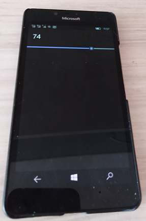
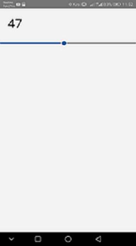

# Uno.Slider.Demo 
Simple multi-platform slider =)

## Screenshots

## Architecture
### [UnoSliderDemo.Shared](UnoSliderDemo.Shared) - Shared part of code
### [UnoSliderDemo.Droid](UnoSliderDemo.Droid) - Android part of code
### [UnoSliderDemo.UWP](UnoSliderDemo.UWP) - "Universal" (Win10/Mobile) part of code
### [UnoSliderDemo.iOS](UnoSliderDemo.iOS) - iOS part of code
### [UnoSliderDemo.macOS](UnoSliderDemo.macOS) - MacOS part of code
### [UnoSliderDemo.Wasm](UnoSliderDemo.Wasm) - "Web" part of code (hello, webdev!))

## Install instructions
* Install newest Visual Studio 2022 (Preview or maybe RC) 
* Install .NET, Xamarin, Web dev. workloads
* Find and install .NET 5 and .NET Core 5 (optional, only if You interesting in WASM) 
* Install UNO Platform extension
   

## Changelog
### v1.0.*

Conditional framework's builds according to platform specifics.
  
Provide a sample application.

# Contribute!
There's still a TON of things missing from this proof-of-concept (MVP) and areas of improvement 
which I just haven't had the time to get to yet.
- UI Improvements (for GTK, for example, or for each one of supported mutli-platforms)))
- New features (toasts, etc..))
- Additional Language Packages
- Media Transferring Support: screenshots, etc. (for the brave)

## Solution Layout
I shere this demo because of it's good for your own R.E. :)
There are no DOCs which explains all architecture and etc. yet... this is just my UNO beginning! =) 

With best wishes,

  [m][e] 2021

## Thanks!
I wanted to put down some thank you's here for folks/projects/websites that were invaluable for helping me get this project into a functional state:
* [Piotr Karocki](https://github.com/pkar70/) - this great man made my UNO discovering! =)
* [Uno Platform](https://github.com/uno) "Uno Momento" =)))))))))

## License
MIT License - see the [LICENSE](LICENSE) file for details.
